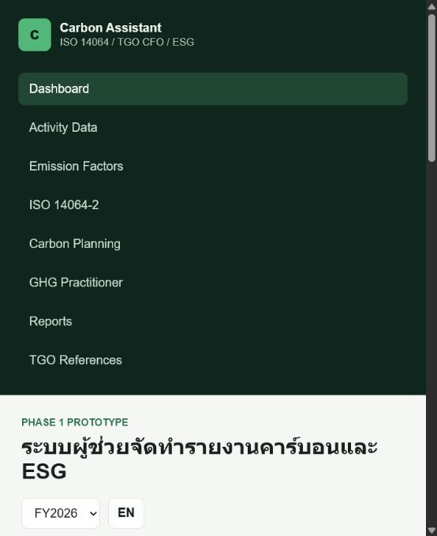

# ESG Carbon Report Assistant

## Project Overview

ESG Carbon Report Assistant is an MVP concept for helping factories organize ESG and carbon-related documentation, activity data, evidence, and reporting workflows.

The project is part of FutureGreen by Sorawit's consulting portfolio for ISO, ESG, Carbon Footprint, CFO, CFP, and sustainability work with Thai SME factories.

TH: ระบบนี้เป็นแนวคิดผู้ช่วยด้าน ESG / Carbon ที่ช่วยจัดข้อมูลกิจกรรม หลักฐาน และโครงรายงานให้เป็นระบบมากขึ้น

## Business Problem

Factories often prepare ESG and carbon reports using many spreadsheets, email attachments, manual evidence folders, and disconnected emission-factor references. This creates risks such as missing evidence, unclear data ownership, weak traceability, and slow report preparation.

For SME factories, the challenge is not only calculation. It is also organizing data, evidence, assumptions, and review status in a way that can support consulting, internal review, and future verification.

## Objective

- Provide a practical ESG / Carbon reporting workflow concept.
- Help organize activity data, evidence, report sections, and consulting notes.
- Demonstrate how an AI-assisted workflow could support sustainability documentation.
- Provide a foundation for future CFO / CFP / GHG inventory implementation.

## Target Users

- ESG managers
- ISO / sustainability officers
- Carbon project teams
- Factory data owners
- Internal reviewers
- Consultants supporting CFO, CFP, or ESG reporting
- Management teams reviewing carbon and sustainability readiness

## Key Features

- ESG / Carbon assistant concept
- Dashboard and reporting workflow
- Carbon activity data structure
- Evidence readiness support
- Report section guidance
- Bilingual Thai / English direction
- Demo data workflow
- AI-ready architecture for future automation

## Tech Stack

- Next.js
- React
- TypeScript
- Tailwind CSS
- Prisma
- PostgreSQL-ready schema
- Zod
- Recharts
- GitHub Pages static demo / deployable web app

## Use Case for Consulting Work

This project can be used to demonstrate how ESG and carbon data can be organized before a formal reporting or carbon-footprint project.

Example consulting use cases:

- CFO / CFP readiness discussion
- ESG documentation planning
- Evidence gap review
- GHG inventory workflow design
- Client demonstration for moving beyond spreadsheets

## Project Status

MVP

The project has a working application structure and demonstration workflow. It is not production-ready because production authentication, role-based access control, secure evidence storage, backup, monitoring, and full deployment hardening are not yet completed.

## Demo Link

Live Demo: https://thesor55.github.io/esg-carbon-report-assistant/

## Screenshots

## Future Improvement Plan

- Add authentication and role-based access control.
- Add production database deployment.
- Add secure evidence upload and storage.
- Add report export templates.
- Add clearer CFO / CFP / ISO 14064-1 workflows.
- Add audit log UI and reviewer approval flow.

## Disclaimer

This project is an MVP and consulting demonstration tool. It should not be treated as a certified carbon accounting platform or production ESG reporting system without further validation, security review, and implementation controls.

## Recommended GitHub About Description

ESG and carbon report assistant that helps factories organize activity data, evidence, and sustainability documentation.

## Recommended GitHub Topics

`iso` `esg` `carbon-footprint` `cfo` `cfp` `factory-dashboard` `audit-checklist` `sustainability` `smart-factory` `thai-sme` `github-pages`
